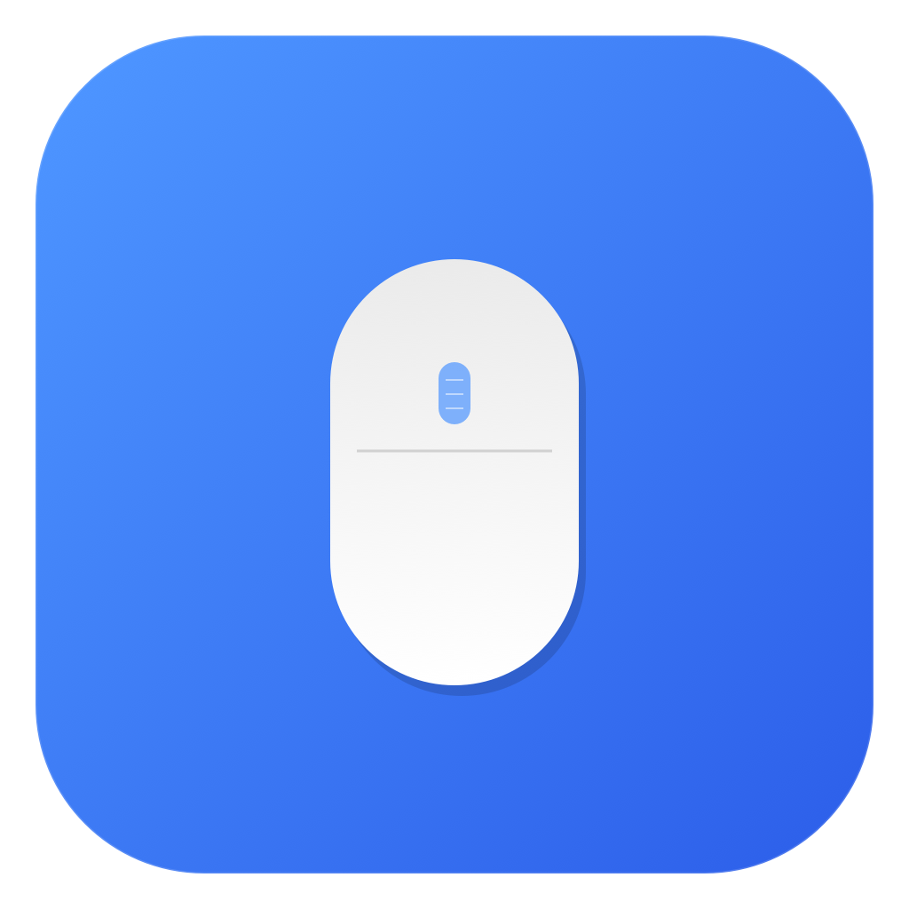

# SmoothScroll

A lightweight macOS menu bar app that makes mouse scroll wheel buttery smooth — like a trackpad.

No subscription. No bloat. Just Swift.

<p align="center">
  
</p>

## Why?

Mouse scroll wheels on macOS feel janky — they send large, discrete jumps instead of the smooth pixel-by-pixel scrolling you get from a trackpad. SmoothScroll intercepts those events and replaces them with smooth, animated scrolling using exponential easing.

Works with any mouse (Logitech, Razer, generic USB mice, etc.) without affecting trackpad behavior.

## Features

- **Smooth scrolling** with exponential ease-out animation at 120Hz
- **Automatic mouse/trackpad detection** — passes trackpad events through unchanged, works with mice that report as "continuous" (e.g. Logitech smooth scroll)
- **Presets** — Silky, Balanced, Fast, Precise — one-click tuning
- **Fine-tuning sliders** for scroll distance and smoothness
- **Instant Stop / Momentum** — choose whether scrolling stops immediately or coasts like a trackpad, with adjustable coast duration
- **Per-app exclusion** — disable smooth scrolling for specific apps
- **Launch at Login** support
- **Settings persist** across restarts via UserDefaults
- Lives in the menu bar — no Dock icon
- Zero dependencies, single Swift file

## Install

### Download (recommended)

1. Go to [**Releases**](https://github.com/negativepl/SmoothScroll/releases/latest)
2. Download **SmoothScroll-1.0.dmg**
3. Open the DMG and drag **SmoothScroll** to **Applications**

### Build from source

Requires Xcode Command Line Tools (`xcode-select --install`).

```bash
git clone https://github.com/negativepl/SmoothScroll.git
cd SmoothScroll
chmod +x build.sh
./build.sh
cp -r build/SmoothScroll.app /Applications/
```

### First launch

1. Open SmoothScroll from `/Applications` or Spotlight
2. macOS will prompt for **Accessibility** permission
3. Go to **System Settings → Privacy & Security → Accessibility** and enable SmoothScroll
4. The app will automatically start working once permission is granted

> **Note:** If you rebuild from source, macOS may revoke the Accessibility permission due to the changed code signature. You'll need to re-enable it in System Settings.

## Usage

Click the mouse icon in the menu bar:

- **Smooth Scrolling** — toggle on/off
- **Settings...** (⌘,) — opens the settings window
- **Launch at Login** — start automatically with macOS
- **Quit**

### Settings

**Presets** — quick configurations:
| Preset | Speed | Smoothness | Best for |
|--------|-------|------------|----------|
| Silky | 0.3x | Very Smooth | Gentle, relaxed browsing |
| Balanced | 0.6x | Smooth | Most users (default) |
| Fast | 1.2x | Normal | Quick navigation |
| Precise | 0.2x | Smooth | Pixel-perfect work |

**Fine Tuning:**
- **Scroll Distance** — how far each scroll notch moves (0.05x – 3.0x)
- **Smoothness** — animation feel from Very Smooth to Responsive
- **Instant Stop / Momentum** — whether scrolling stops in place or coasts after you release the wheel
- **Coast Duration** — how long momentum scrolling continues (when Momentum is selected)

**Disabled for Apps** — add apps where smooth scrolling should be bypassed (e.g. apps with their own smooth scrolling)

## How it works

1. Installs a `CGEventTap` to intercept scroll wheel events globally
2. Detects mouse vs trackpad by checking `scrollWheelEventScrollPhase` — trackpad events have scroll phases, mouse wheel events don't
3. Suppresses the original mouse scroll event
4. Accumulates the pixel delta into a buffer
5. A 120Hz timer drains the buffer using exponential decay, posting smooth pixel-based scroll events
6. Direction changes instantly reset the accumulator for immediate response
7. 1px/frame minimum at the tail end prevents visible pixel jumps
8. When idle for 100ms: either stops instantly or switches to momentum friction

## Requirements

- macOS 13.0+ (Ventura or later)
- Accessibility permission

## License

MIT
